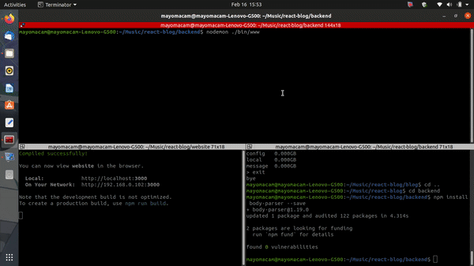

# Agency website

---
## Fronted

#### I have created this website(website folder) using agency theme with Reactjs.


---

## Backend

#### I have created backend of this website(backend folder) using Expressjs, Nodejs and mongodb.


In backend i have a created a api which is saving all the message into database.
And with that created a backend site where user can see all the messages and when he read a message he can delete it.

---

A example of backend terminal log
```
      [Object: null prototype] {
        'x-powered-by': [Array],
        'access-control-allow-origin': [Array] } },
  _startAt: [ 20530, 739504223 ],
  _startTime: 2021-02-16T10:23:33.675Z,
  _remoteAddress: '::ffff:127.0.0.1',
  body:
   { values:
      { name: 'Aman Kumar Maurya',
        email: 'asd@asdf.com',
        phone: '+911234567890',
        message:
         'Section 1.10.33 of "de Finibus Bonorum et Malorum", written by Cicero in 45 BC\n\n"At vero eos et accusamus et iusto odio dignissimos ducimus qui blanditiis praesentium voluptatum deleniti atque corrupti quos dolores et quas molestias excepturi sint occaecati cupiditate non provident, similique sunt in culpa qui officia deserunt mollitia animi, id est laborum et dolorum fuga. Et harum quidem rerum facilis est et expedita distinctio. Nam libero tempore, cum soluta nobis est eligendi optio cumque nihil impedit quo minus id quod maxime placeat facere possimus, omnis voluptas assumenda est, omnis dolor repellendus. Temporibus autem quibusdam et aut officiis debitis aut rerum necessitatibus saepe eveniet ut et voluptates repudiandae sint et molestiae non recusandae. Itaque earum rerum hic tenetur a sapiente delectus, ut aut reiciendis voluptatibus maiores alias consequatur aut perferendis doloribus asperiores repellat."\n1914 translation by H. Rackham\n\n"On the other hand, we denounce with righteous indignation and dislike men who are so beguiled and demoralized by the charms of pleasure of the moment, so blinded by desire, that they cannot foresee the pain and trouble that are bound to ensue; and equal blame belongs to those who fail in their duty through weakness of will, which is the same as saying through shrinking from toil and pain. These cases are perfectly simple and easy to distinguish. In a free hour, when our power of choice is untrammelled and when nothing prevents our being able to do what we like best, every pleasure is to be welcomed and every pain avoided. But in certain circumstances and owing to the claims of duty or the obligations of business it will frequently occur that pleasures have to be repudiated and annoyances accepted. The wise man therefore always holds in these matters to this principle of selection: he rejects pleasures to secure other greater pleasures, or else he endures pains to avoid worse pains."' } },
  _body: true,
  length: undefined,
  secret: undefined,
  cookies: [Object: null prototype] {},
  signedCookies: [Object: null prototype] {},
  originalMethod: 'POST',
  route:
   Route {
     path: '/',
     stack: [ [Layer], [Layer] ],
     methods: { post: true } },
  messages:
   { _id: 602b9d25f6c5c09131b2e06c,
     sendedAt: 2021-02-16T10:23:33.701Z } }
=================
POST /api 200 102.741 ms - 86
GET / 200 12.741 ms - 1664
GET /section-11033-of- 200 8.740 ms - 2969
GET / 304 4.775 ms - -
GET /const-dataconst-data 304 7.757 ms - -
DELETE /602b84ae753c956ddab85088?_method=DELETE 302 33.588 ms - 46
GET / 200 4.528 ms - 1105
```
